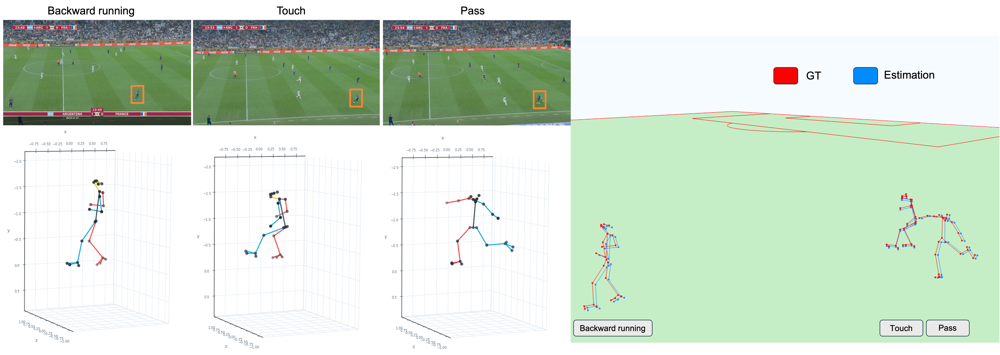
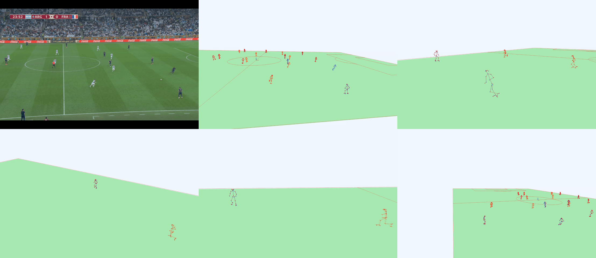
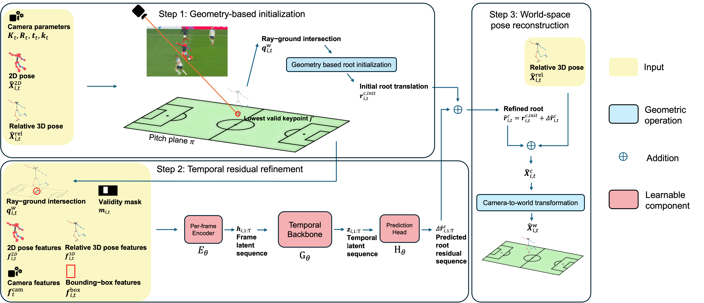

<h1 align="center">Field Converter: Geometry-Initialized Temporal Residual Refinement for World-Grounded Player Pose Estimation from Soccer Broadcasts </h1>

<p align="center">
  Simon Khan<sup>1,2</sup> &nbsp;&middot;&nbsp;
  Laurent Gajny<sup>1</sup> &nbsp;&middot;&nbsp;
  Jennyfer Lecompte<sup>2</sup> &nbsp;&middot;&nbsp;
  Sébastien Laporte<sup>1</sup>
</p>

<p align="center">
  <sup>1</sup>Institut de Biomécanique Humaine Georges Charpak (IBHGC), Arts et Métiers ParisTech, Paris, France<br>
  <sup>2</sup>French Football Federation (FFF), Clairefontaine-en-Yvelines, France
</p>

<p align="center">
  
</p>

<p align="center"><em>
From monocular broadcast video to world-grounded 3D player pose. Left: three actions observed in the broadcast and their corresponding camera-relative, self-centered 3D poses. Right: the same reconstructed poses localized in a common metric field coordinate system, where their positions can be directly related to the pitch and to one another.
</em></p>

## Qualitative results

<p align="center"><em>
  <td></td>
</p>
<p align="center"><em>
5 world grounded estimations from the same clip. Ground truth in red and estimation in orange and blue. </em></p>

## Overview

Field Converter localizes camera-relative 3D player poses in a shared, metric soccer-field coordinate system. Given synchronized player tracks, calibrated cameras, image-space keypoints, and self-centered 3D poses, it first obtains a geometry-based estimate of each player's root translation. A non-causal temporal model then predicts a residual correction before the relative skeleton is reconstructed in camera coordinates and transformed into the world frame.

This repository provides the two best temporal variants:

- **Field Converter-TCN**: a 41-frame temporal convolutional network with approximately 1.28 million parameters;
- **Field Converter-Transformer**: a 41-frame Transformer encoder with approximately 1.25 million parameters.

Both models operate at **50 FPS**. Field Converter implements the geometry and temporal localization stage; it does not detect players, estimate camera calibration, or infer a relative pose directly from raw video. Relative 2D and 3D player poses can be obtained with [SAM 3D Body](https://github.com/facebookresearch/sam-3d-body).

## Method

<p align="center">
  
</p>

<p align="center"><em>
Proposed Field Converter method. First, a geometry-based initialization estimates the player root from the calibrated camera, the relative 3D pose, and a ray-ground intersection. Second, a temporal model predicts a residual correction using pose, image, camera, and geometric cues. Finally, the refined root anchors the relative skeleton in camera coordinates before transformation to the common world coordinate system.
</em></p>

For each player and frame, the initialization intersects the camera ray passing through the lowest valid keypoint with the pitch plane. The temporal network receives pose, bounding-box, camera, projected-pitch, and geometric features and estimates a normalized root residual. Overlapping temporal windows are averaged to produce dense predictions.

The portable model configurations are:

- [`configs/paper/field_converter_tcn.yaml`](configs/paper/field_converter_tcn.yaml)
- [`configs/paper/field_converter_transformer.yaml`](configs/paper/field_converter_transformer.yaml)

## Results

The table reports mean errors on the held-out `ENG_FRA` match, comprising 15 broadcast sequences. Lower is better.

| Method | Temporal window | Root Error (cm) ↓ | Global MPJPE (cm) ↓ | Reprojection Error (px) ↓ |
|---|---:|---:|---:|---:|
| Geometry initialization | – | 48.58 | 48.36 | 5.39 |
| **Field Converter-TCN** | 41 frames | **10.12** | **13.20** | 3.49 |
| **Field Converter-Transformer** | 41 frames | 11.04 | 13.21 | **3.43** |

Global MPJPE is evaluated after transforming the reconstructed skeletons into the common world coordinate system. Reprojection error is measured in image pixels.

## Getting Started

### Tested environment

The code was tested with:

- Linux;
- Python 3.11.15;
- PyTorch 2.6.0;
- CUDA 12.4;
- NumPy 2.4.4.

Experiments were run on a single NVIDIA L40S GPU with 48 GB of VRAM.

### Installation

Clone the repository and create the tested environment:

```bash
git clone https://github.com/KhanSimon/field_converter.git
cd field_converter

conda create -n field-converter python=3.11 -y
conda activate field-converter
```

Install the CUDA 12.4 build of PyTorch, then install Field Converter in editable mode:

```bash
python -m pip install torch==2.6.0 --index-url https://download.pytorch.org/whl/cu124
python -m pip install -e .
```

Check the installation:

```bash
python -c "import torch, field_converter; print(torch.__version__); print('CUDA:', torch.cuda.is_available())"
```

## Data

The training data and broadcast videos are not distributed with this repository. Users must obtain the dataset separately and comply with its access and usage conditions. See the [FIFA Skeletal Tracking Starter Kit](https://github.com/FIFA-Skeletal-Light-Tracking-Challenge/FIFA-Skeletal-Tracking-Starter-Kit-2026) for the expected data organization.

Training assumes that the consolidated features, normalization statistics, split definition, and geometry-based root initialization have already been prepared:

```text
data/
├── features_normalized/
│   ├── normalization_stats.npz
│   ├── split.json
│   ├── train/<sequence>.npz
│   ├── valid/<sequence>.npz
│   └── test/<sequence>.npz
├── root_init_cam_normalized/
│   ├── train/<sequence>.npy
│   ├── valid/<sequence>.npy
│   └── test/<sequence>.npy
└── pitch_points.txt
```

The supplied model configurations use these default paths. Change `data_dir` and `root_init_dir` in the YAML files if the prepared data are stored elsewhere.

## Training

Train the TCN:

```bash
python -m field_converter.training.train_root_tcn \
  --config configs/paper/field_converter_tcn.yaml
```

Train the Transformer:

```bash
python -m field_converter.training.train_root_transformer \
  --config configs/paper/field_converter_transformer.yaml
```

Each run saves the following artifacts:

```text
outputs/
├── checkpoints/<run_name>/
│   ├── best.pt
│   └── last.pt
└── eval_reports/<run_name>/
    ├── config_used.yaml
    ├── train_log.csv
    └── train_summary.json
```

Evaluate the best checkpoints:

```bash
python -m field_converter.training.evaluate_root_tcn \
  --config configs/paper/field_converter_tcn.yaml \
  --checkpoint best

python -m field_converter.training.evaluate_root_transformer \
  --config configs/paper/field_converter_transformer.yaml \
  --checkpoint best
```

Metrics are written to `outputs/eval_reports/<run_name>/metrics.json`, and dense predictions are saved under `outputs/predictions/<run_name>/`.

## Inference

> Pretrained TCN and Transformer weights will be available on Hugging Face soon. A release bundle must pair each checkpoint with its exact YAML configuration and training normalization statistics; a `.pt` file alone is not sufficient.

### Required inputs

Inference expects synchronized inputs sampled at **50 FPS**. It starts from calibrated, precomputed player observations rather than a raw broadcast video.

```text
data/data_inference/
├── boxes/<sequence>.npy
├── cameras/<sequence>.npz
├── skel_2d/<sequence>.npy
├── skel_3d_relative/<sequence>.npy
└── frames/<sequence>/*.jpg        # optional; used only for source frame numbers
```

For a sequence with `T` frames and `N` tracked players:

| Input | Expected shape | Description |
|---|---|---|
| `boxes/<sequence>.npy` | `(T, N, 4)` or `(N, T, 4)` | Player boxes in pixel-space `xyxy` format. |
| `skel_2d/<sequence>.npy` | `(T, N, 25, 2)` or `(N, T, 25, 2)` | Image-space joints in pixels. |
| `skel_3d_relative/<sequence>.npy` | `(T, N, 25, 3)` or `(N, T, 25, 3)` | Camera-relative, self-centered 3D joints in metres. |
| `cameras/<sequence>.npz` | per-frame arrays | Calibrated camera parameters `K`, `R`, `t`, and optionally `k`. |

The camera archive must contain `K` with shape `(T, 3, 3)`, `R` with shape `(T, 3, 3)`, and `t` with shape `(T, 3)`. Radial distortion coefficients `k` with shape `(T, D)`, where `D >= 2`, are optional; only `k1` and `k2` are used. The camera convention is:

```text
X_cam = X_world @ R.T + t
```

All inputs must share the same timeline and player ordering. Time-major arrays `(T, N, ...)` are recommended. The canonical pitch geometry is read from `data/pitch_points.txt`.

### Camera domain

The models were trained with a centered FIFA field coordinate system close to 105 m × 68 m, with field length along `x`, width along `y`, and the pitch plane at `z = 0`. The camera centers observed during training were:

| Axis | Training range | Mean ± standard deviation |
|---|---:|---:|
| `x` | `[-0.128, 0.323] m` | `0.112 ± 0.120 m` |
| `y` | `[-88.155, -66.729] m` | `-75.181 ± 6.200 m` |
| `z` | `[11.765, 19.039] m` | `16.459 ± 2.102 m` |

Cameras far outside these ranges, or data expressed with a different field scale, origin, or calibration convention, are outside the training distribution and may reduce accuracy.

### Run inference

Run the locally trained TCN checkpoint:

```bash
python -m field_converter.inference \
  --model-type tcn \
  --config configs/paper/field_converter_tcn.yaml \
  --checkpoint outputs/checkpoints/field_converter_tcn/best.pt \
  --input-dir data/data_inference \
  --sequence SEQUENCE_NAME \
  --source-fps 50 \
  --target-fps 50
```

Run the locally trained Transformer checkpoint:

```bash
python -m field_converter.inference \
  --model-type transformer \
  --config configs/paper/field_converter_transformer.yaml \
  --checkpoint outputs/checkpoints/field_converter_transformer/best.pt \
  --input-dir data/data_inference \
  --sequence SEQUENCE_NAME \
  --source-fps 50 \
  --target-fps 50
```

Repeat `--sequence` to process several sequences, or omit it to process every complete sequence in the input directory.

### Inference outputs

```text
outputs/predictions/inference/<run_name>/<sequence>/
├── predictions.npz
├── root_predictions.csv
└── summary.json
```

`predictions.npz` contains dense `(N, T, ...)` arrays, including the refined roots in camera coordinates (`root_pred_m`), roots in metric field coordinates (`root_world_pred_m`), reconstructed 3D joints, 2D projections, geometry-based initializations, camera parameters, validity masks, and timing metadata. Invalid or uncovered player-frame positions are stored as `NaN`.

Unless `--no-save-intermediate` is passed, preprocessing artifacts are also saved under `data/data_inference/{features,features_normalized,ground_intersection,root_init_cam,root_init_cam_normalized}/`.

## Repository Structure

```text
field_converter/
├── assets/                       # Teaser and method figures
├── configs/paper/                # TCN and Transformer release configurations
├── data/                         # Dataset documentation and local data
├── src/field_converter/
│   ├── data_preparation/          # Feature construction and normalization
│   ├── geometry/                  # Projection and coordinate transforms
│   ├── models/                    # TCN and Transformer refiners
│   ├── training/                  # Datasets, trainers, and evaluation entry points
│   ├── inference/                 # External-sequence preprocessing and prediction
│   └── evaluation/                # Metrics and visualizations
└── pyproject.toml
```

## Limitations

- Field Converter requires reliable player tracks, calibrated cameras, and upstream 2D/3D pose estimates.
- Both temporal models are non-causal and use future as well as past context; they are intended for offline processing.
- Accuracy may degrade for camera placements, field conventions, or image statistics outside the training distribution.

